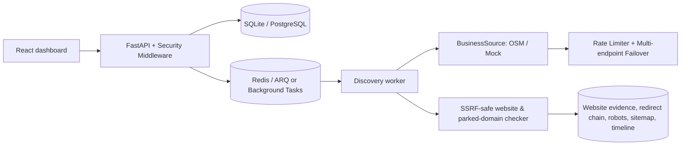

# LankaLead

**Discover Sri Lankan businesses. Understand their online presence.**

LankaLead is a Sri Lanka-focused business discovery and website-presence analysis platform. Its central product rule is evidence-based uncertainty: **Website Not Detected is not the same as “this business has no website.”**

## MVP features

- FastAPI backend with typed SQLAlchemy models and protected JWT endpoints
- Configurable location/category tables and fictional Sri Lankan development data
- Replaceable `BusinessSource` provider interface with OpenStreetMap/Overpass as the default real provider
- Asynchronous discovery-run API with progress counters and worker entry point
- URL normalization and SSRF-aware website checking with redirect revalidation
- React + TypeScript dashboard shell for authenticated business results
- PostgreSQL, Redis, Docker Compose, pytest, Ruff, MyPy, and frontend build scaffolding

## Setup and migrations

Docker is optional. The default configuration uses a local SQLite database and FastAPI's in-process background tasks, so you only need Python and Node.js.

```powershell
Copy-Item .env.example .env
python -m venv .venv
.\.venv\Scripts\Activate.ps1
pip install -e .\backend[dev]
alembic upgrade head
python .\backend\seed.py
python -m uvicorn app.main:app --app-dir backend --reload
```

In another terminal:

```powershell
Set-Location frontend
npm install
npm run dev
```

The API is available at `http://localhost:8000/docs`; the Vite app is available at `http://localhost:5173`.

## Architecture & capabilities



### 1. Live provider reliability
- Configurable multiple Overpass endpoints with automatic failover
- Exponential backoff with retry logic for HTTP 429, 502, 503, 504 and network timeouts
- Client-side token bucket rate limiting on outgoing provider requests
- Distinct provider error classification (`ProviderError`, `ProviderTimeoutError`, `ProviderRateLimitError`, `ProviderLocationNotFoundError`)
- Live provider health and status check endpoint (`GET /api/providers/status`)

### 2. Rich website presence evidence
- SSRF-safe redirect-chain persistence (every hop validated against loopback, link-local, private, and reserved addresses)
- Automated robots.txt and sitemap.xml detection
- HTML meta description and title extraction
- Parked and for-sale domain detection (GoDaddy, Sedo, HugeDomains, Dan.com, etc.)
- Business name and phone number presence verification against page content
- Quantitative evidence confidence score (0.0 to 1.0)
- Explicit objective classifications (`Website Found`, `Website Not Detected`, `Website Status Unclear`, `Website Unreachable`, `Website Parked`, `Social Presence Only`)

### 3. Discovery results & exports
- Filtering by category, location (province, district, city), website status, discovery run ID, source, search query, and creation dates
- Multi-field sorting and pagination
- CSV and JSON exports supporting all active filters and real status values

### 4. Dedicated business detail & timeline
- Dedicated hash-based routing (`#/business/:id`)
- Visual audit trail distinguishing `Verified Public Record`, `Source Data`, and `Inferred Analysis`
- Full check history with latency, HTTP codes, HTTPS validation, and redirect hops
- Direct links to provider source records and discovered social profiles

### 5. Database migrations
- Alembic async integration configured with idempotent migrations
- Automated migration upgrade command: `alembic upgrade head`

### 6. Security and reliability
- Sliding-window client-IP rate limiting middleware (configurable requests per minute)
- Hardened security headers (`X-Content-Type-Options: nosniff`, `X-Frame-Options: DENY`, `Referrer-Policy`, `X-XSS-Protection`)
- Unique request tracing IDs (`X-Request-ID`) on every request and response
- Structured request logging
- Configurable CORS origins (`CORS_ORIGINS`)
- Liveness (`GET /api/health`) and readiness (`GET /api/health/ready`) endpoints
- Token refresh endpoint (`POST /api/auth/refresh`)

## Testing and quality

```powershell
# Backend tests & linters
python -m pytest backend/tests
ruff check backend
mypy backend/app

# Frontend tests & production build
Set-Location frontend
npm test
npm run build
```

## Security and data-source considerations

The checker rejects loopback/private/link-local/reserved addresses, internal hostnames, and redirects into private networks. It uses bounded timeouts and response reads; it does not crawl aggressively or perform vulnerability scanning. Do not add unauthorized social scraping or commit provider credentials. Mock records are fictional and must remain clearly labeled as development data.

## Roadmap

Permitted external providers, full ARQ enqueue/retry orchestration, richer evidence and duplicate review, map view, admin workflows, organizations, scheduled discovery, monitoring, and deployment-specific observability are intentionally extension points for subsequent iterations.
